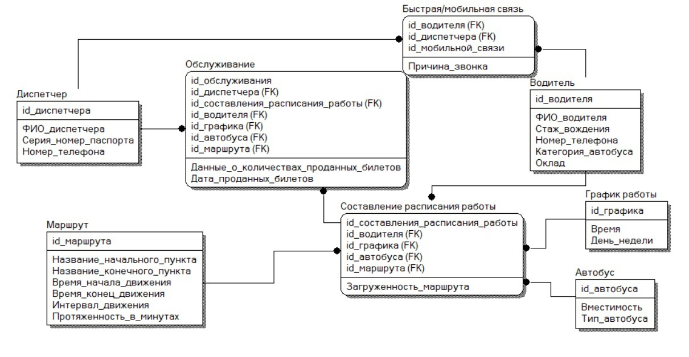

# Описание программной системы
Програмнная система позволяет обслуживать несколько коммерческих маршрутов.

Система обеспечивает хранение сведений о водителях, о маршрутах и характеристиках автобусов.

